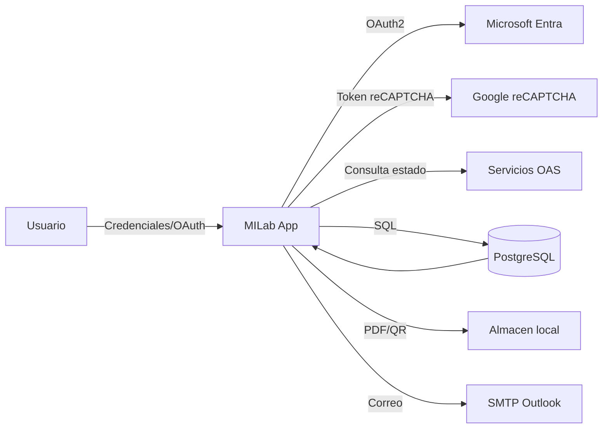

# Flujo de datos

## Proposito

Flujo de datos principal entre usuarios, app, BD y servicios externos.

## Diagrama (Mermaid)

```mermaid
flowchart LR
  user[Usuario] -->|Credenciales/OAuth| app[MILab App]
  app -->|OAuth2| entra[Microsoft Entra]
  app -->|Token reCAPTCHA| recaptcha[Google reCAPTCHA]
  app -->|Consulta estado| oas[Servicios OAS]
  app -->|SQL| db[(PostgreSQL)]
  app -->|PDF/QR| storage[Almacen local]
  app -->|Correo| smtp[SMTP Outlook]
  db --> app
```
