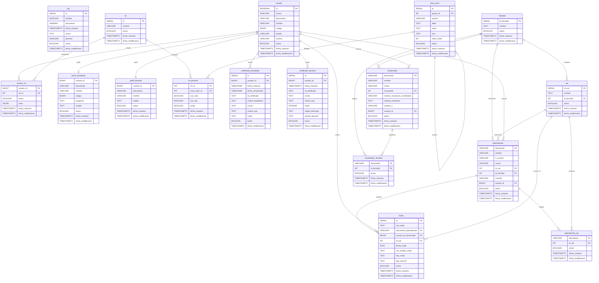

# ERD (Modelo de datos)

## Proposito

Modelo relacional principal de MILab basado en `sql-scripts/db_structure.sql`.

## Diagrama (Mermaid)

## Referencias De Esquema

| Tabla | Columnas principales |
| --- | --- |
| `log` | id, nombre, documento, fecha_creacion, accion, persona, activo, fecha_modificacion |
| `usuario` | id, correo, documento, nombre, codigo, estado, carrera, activo, fecha_creacion, fecha_modificacion |
| `rol` | id, nombre, activo, fecha_creacion, fecha_modificacion |
| `usuario_rol` | usuario_id, rol_id, activo, meta, fecha_creacion, fecha_modificacion |
| `perfil_estudiante` | usuario_id, documento, nombre, codigo, programa, estado, activo, fecha_creacion, fecha_modificacion |
| `perfil_docente` | usuario_id, documento, nombre, estado, activo, fecha_creacion, fecha_modificacion |
| `menu_item` | id, parent_id, section, label, route, icon, order_index, activo, fecha_creacion, fecha_modificacion |
| `rol_permiso` | rol_id, menu_item_id, can_view, can_use, activo, fecha_creacion, fecha_modificacion |
| `certificado_estudiante` | id, usuario_id, fecha_creacion, fecha_vencimiento, id_certificado, motivo_expedicion, correo, motivo_exp, multa, activo, fecha_modificacion |
| `certificado_docente` | id, usuario_id, fecha_creacion, id_certificado, correo, motivo_exp, multa, origen_descarga, estado_docente, activo, fecha_modificacion |
| `facultad` | id_facultad, nombre, activo, fecha_creacion, fecha_modificacion |
| `ual` | id_ual, nombre, id_facultad, activo, fecha_creacion, fecha_modificacion |
| `laboratorista` | documento, nombre, n_usuario, correo, id_ual, id_facultad, contrato, usuario_id, activo, fecha_creacion, fecha_modificacion |
| `coordinador` | documento, nombre, correo, id_facultad, numero_resolucion_coordinador, soporte_resolucion, nombre_u, usuario_id, activo, fecha_creacion, fecha_modificacion |
| `coordinador_facultad` | documento, id_facultad, activo, fecha_creacion, fecha_modificacion |
| `laboratorista_ual` | documento, id_ual, activo, fecha_creacion, fecha_modificacion |
| `multa` | id, cat_multa, documento_laboratorista, usuario_id_sancionado, id_ual, fecha_multa, con_estado_multa, obs_multa, tipo_sancion, activo, fecha_creacion, fecha_modificacion |

## Notas De Modelado

- El esquema canónico ya no usa las tablas `estudiante` y `docente` como entidades principales del dominio.
- Las sanciones (`multa`) ya están conectadas por claves foráneas reales a `laboratorista`, `usuario` y `ual`.
- `coordinador.id_facultad` y `laboratorista.id_ual` / `id_facultad` siguen existiendo, pero las tablas `coordinador_facultad` y `laboratorista_ual` son las relaciones que soportan alcance múltiple.
