# ERD (Modelo de datos)

## Proposito

Modelo relacional principal basado en sql-scripts/db_structure.sql.

## Diagrama (Mermaid)

```mermaid
erDiagram
  logs {
    SERIAL id PK
    VARCHAR nombre
    NUMERIC documento
    TIMESTAMPTZ fecha_hora
    TEXT accion
    VARCHAR persona
  }

  usuarios {
    BIGSERIAL id PK
    TEXT correo
    VARCHAR documento
    TEXT nombre
  }

  roles {
    SERIAL id PK
    VARCHAR name
  }

  usuario_roles {
    BIGINT usuario_id FK
    INT role_id FK
    BOOLEAN activo
    JSONB meta
  }

  perfil_estudiante {
    BIGINT usuario_id PK
    VARCHAR documento
    BIGINT codigo
    TEXT programa
    TEXT estado
  }

  perfil_docente {
    BIGINT usuario_id PK
    VARCHAR documento
    TEXT estado
  }

  menu_items {
    SERIAL id PK
    INT parent_id FK
    VARCHAR section
    TEXT label
    TEXT route
    BOOLEAN is_active
  }

  role_permissions {
    INT role_id FK
    INT menu_item_id FK
    BOOLEAN can_view
    BOOLEAN can_use
  }

  estudiante {
    SERIAL id PK
    NUMERIC cc
    NUMERIC codigo
    TEXT programa
    TEXT estado_estudiante
    TEXT correo
  }

  docente {
    SERIAL id PK
    NUMERIC cc
    TEXT estado_docente
    TEXT correo
  }

  multas {
    SERIAL id PK
    TEXT cat_multa
    NUMERIC cod_multado
    TEXT ual
    VARCHAR n_usuario
  }

  usuario {
    VARCHAR documento PK
    BIGINT codigo
    VARCHAR nombre
    VARCHAR correo
    VARCHAR estado
    VARCHAR carrera
  }

  auth {
    VARCHAR documento PK
    VARCHAR password
    VARCHAR tipo
    BOOLEAN password_cambiado
    VARCHAR correo
  }

  facultad {
    SERIAL id_facultad PK
    TEXT nombre
  }

  ual {
    SERIAL id_ual PK
    TEXT nombre
    INT id_facultad FK
  }

  laboratorista {
    VARCHAR documento PK
    VARCHAR n_usuario
    VARCHAR correo
    INT id_ual FK
    INT id_facultad FK
    BIGINT usuario_id FK
  }

  coordinador_laboratorio {
    VARCHAR documento PK
    VARCHAR nombre
    VARCHAR correo
    INT id_facultad FK
    VARCHAR nombre_u
    BIGINT usuario_id FK
  }

  coordinador_facultad {
    VARCHAR documento FK
    INT id_facultad FK
  }

  laboratorista_ual {
    VARCHAR documento FK
    INT id_ual FK
  }

  usuarios ||--o{ usuario_roles : asigna
  roles ||--o{ usuario_roles : pertenece
  roles ||--o{ role_permissions : concede
  menu_items ||--o{ role_permissions : habilita
  menu_items ||--o{ menu_items : parent
  usuarios ||--o{ perfil_estudiante : perfil
  usuarios ||--o{ perfil_docente : perfil
  facultad ||--o{ ual : contiene
  facultad ||--o{ coordinador_laboratorio : referencia
  facultad ||--o{ coordinador_facultad : asigna
  coordinador_laboratorio ||--o{ coordinador_facultad : gestiona
  laboratorista ||--o{ laboratorista_ual : asigna
  ual ||--o{ laboratorista_ual : contiene
  facultad ||--o{ laboratorista : referencia
  ual ||--o{ laboratorista : referencia
  usuarios ||--o{ laboratorista : vinculo
  usuarios ||--o{ coordinador_laboratorio : vinculo
```

## Referencias de esquema

| Tabla                   | Columnas (orden en db_structure.sql)                                                                                                                 |
| ----------------------- | ---------------------------------------------------------------------------------------------------------------------------------------------------- |
| logs                    | id, nombre, documento, fecha_hora, accion, persona                                                                                                   |
| usuarios                | id, correo, documento, nombre, created_at, updated_at                                                                                                |
| roles                   | id, name                                                                                                                                             |
| usuario_roles           | usuario_id, role_id, activo, meta, created_at, updated_at                                                                                            |
| perfil_estudiante       | usuario_id, documento, codigo, programa, estado, created_at, updated_at                                                                              |
| perfil_docente          | usuario_id, documento, estado, created_at, updated_at                                                                                                |
| menu_items              | id, parent_id, section, label, route, icon, order_index, is_active                                                                                   |
| role_permissions        | role_id, menu_item_id, can_view, can_use                                                                                                             |
| estudiante              | id, nombre, cc, codigo, programa, estado_estudiante, fecha_creacion, fecha_vencimiento, id_certificado, motivo_expedicion, correo, motivo_exp, multa |
| docente                 | id, nombre, cc, estado_docente, fecha_creacion, id_certificado, correo, motivo_exp, multa, origen_descarga                                           |
| multas                  | id, cat_multa, nombre_laboratorista, cc_laboratorista, cod_multado, ual, fecha_multa, con_estado_multa, obs_multa, n_usuario, tipo_sancion           |
| usuario                 | documento, codigo, nombre, correo, estado, carrera                                                                                                   |
| auth                    | documento, password, tipo, password_cambiado, correo                                                                                                 |
| facultad                | id_facultad, nombre                                                                                                                                  |
| ual                     | id_ual, nombre, id_facultad                                                                                                                          |
| laboratorista           | documento, nombre, n_usuario, correo, id_ual, id_facultad, contrato, usuario_id                                                                      |
| coordinador_laboratorio | documento, nombre, correo, id_facultad, numero_resolucion_coordinador, soporte_resolucion, nombre_u, usuario_id                                      |
| coordinador_facultad    | documento, id_facultad                                                                                                                               |
| laboratorista_ual       | documento, id_ual                                                                                                                                    |
