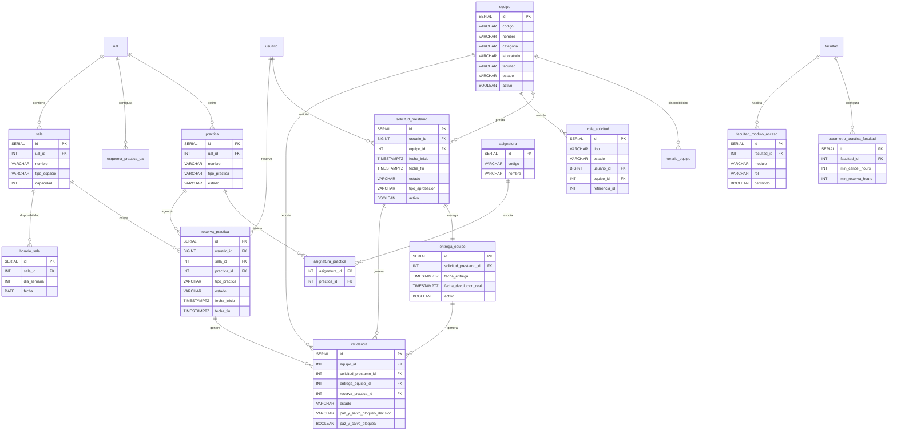

# ERD (Modelo de datos)

    SERIAL facultad_id PK

## Proposito

Modelo relacional principal de MILab basado en `sql-scripts/db_structure.sql`.

## Diagrama (Mermaid)

```mermaid
    SERIAL ual_id PK
  log {
    INT facultad_id FK
    VARCHAR nombre
    NUMERIC documento
    TIMESTAMPTZ fecha_creacion
    TEXT accion
    VARCHAR persona
    BOOLEAN activo
    TIMESTAMPTZ fecha_modificacion
  }

  usuario {
    INT ual_id FK
    VARCHAR correo
    VARCHAR documento
    VARCHAR nombre
    BIGINT codigo
    VARCHAR estado
    VARCHAR carrera
    BOOLEAN activo
    TIMESTAMPTZ fecha_creacion
    TIMESTAMPTZ fecha_modificacion
  }

  rol {
    INT facultad_id FK
    VARCHAR nombre
    BOOLEAN activo
    TIMESTAMPTZ fecha_creacion
    TIMESTAMPTZ fecha_modificacion
  }

  usuario_rol {
    BIGINT usuario_id FK
    INT rol_id FK
    BOOLEAN activo
    JSONB meta
    TIMESTAMPTZ fecha_creacion
    TIMESTAMPTZ fecha_modificacion
  }
    INT ual_id FK
  perfil_estudiante {
    BIGINT usuario_id PK
    VARCHAR documento
    VARCHAR nombre
    BIGINT codigo
    TEXT programa
    TEXT estado
    BOOLEAN activo
    TIMESTAMPTZ fecha_creacion
    TIMESTAMPTZ fecha_modificacion
  }

  perfil_docente {
    BIGINT usuario_id PK
    VARCHAR documento
    VARCHAR nombre
    TEXT estado
    BOOLEAN activo
    TIMESTAMPTZ fecha_creacion
    TIMESTAMPTZ fecha_modificacion
  }

  menu_item {
    SERIAL id PK
    INT parent_id FK
    VARCHAR section
    TEXT label
    TEXT route
    TEXT icon
    INT order_index
    BOOLEAN activo
    TIMESTAMPTZ fecha_creacion
    TIMESTAMPTZ fecha_modificacion
  }

  rol_permiso {
    INT rol_id FK
    INT menu_item_id FK
    BOOLEAN can_view
    BOOLEAN can_use
    BOOLEAN activo
    TIMESTAMPTZ fecha_creacion
    TIMESTAMPTZ fecha_modificacion
  }

  certificado_estudiante {
    SERIAL id PK
    BIGINT usuario_id FK
    TIMESTAMP fecha_creacion
    TIMESTAMP fecha_vencimiento
    TEXT certificado_id
    TEXT motivo_expedicion
    TEXT correo
    TEXT motivo_exp
    TEXT multa
    BOOLEAN activo
    TIMESTAMPTZ fecha_modificacion
  }

  certificado_docente {
    SERIAL id PK
    BIGINT usuario_id FK
    TIMESTAMPTZ fecha_creacion
    TEXT certificado_id
    TEXT correo
    TEXT motivo_exp
    INTEGER multa
    TEXT origen_descarga
    TEXT estado_docente
    BOOLEAN activo
    TIMESTAMPTZ fecha_modificacion
  }

  facultad {
    SERIAL facultad_id PK
    TEXT nombre
    BOOLEAN activo
    TIMESTAMPTZ fecha_creacion
    TIMESTAMPTZ fecha_modificacion
  }

  ual {
    SERIAL ual_id PK
    TEXT nombre
    INT facultad_id FK
    BOOLEAN activo
    TIMESTAMPTZ fecha_creacion
    TIMESTAMPTZ fecha_modificacion
  }

  laboratorista {
    VARCHAR documento PK
    VARCHAR nombre
    VARCHAR n_usuario
    VARCHAR correo
    VARCHAR contrato
    BIGINT usuario_id FK
    BOOLEAN activo
    TIMESTAMPTZ fecha_creacion
    TIMESTAMPTZ fecha_modificacion
  }

  coordinador {
    VARCHAR documento PK
    VARCHAR nombre
    VARCHAR correo
    VARCHAR numero_resolucion_coordinador
    TEXT soporte_resolucion
    VARCHAR nombre_u
    BIGINT usuario_id FK
    BOOLEAN activo
    TIMESTAMPTZ fecha_creacion
    TIMESTAMPTZ fecha_modificacion
  }

  coordinador_facultad {
    VARCHAR coordinador_documento_id FK
    INT facultad_id FK
    BOOLEAN activo
    TIMESTAMPTZ fecha_creacion
    TIMESTAMPTZ fecha_modificacion
  }

  laboratorista_ual {
    VARCHAR laboratorista_documento_id FK
    INT ual_id FK
    BOOLEAN activo
    TIMESTAMPTZ fecha_creacion
    TIMESTAMPTZ fecha_modificacion
  }

  multa {
    SERIAL id PK
    TEXT cat_multa
    VARCHAR laboratorista_documento_id FK
    BIGINT usuario_sancionado_id FK
    INT ual_id FK
    DATE fecha_multa
    TEXT con_estado_multa
    TEXT obs_multa
    TEXT tipo_sancion
    BOOLEAN activo
    TIMESTAMPTZ fecha_creacion
    TIMESTAMPTZ fecha_modificacion
  }

  usuario ||--o{ usuario_rol : asigna
  rol ||--o{ usuario_rol : pertenece
  rol ||--o{ rol_permiso : concede
  menu_item ||--o{ rol_permiso : habilita
  menu_item ||--o{ menu_item : parent
  usuario ||--|| perfil_estudiante : perfil
  usuario ||--|| perfil_docente : perfil
  usuario ||--o{ certificado_estudiante : emite
  usuario ||--o{ certificado_docente : emite
  facultad ||--o{ ual : contiene
  facultad ||--o{ coordinador_facultad : asigna
  coordinador ||--o{ coordinador_facultad : gestiona
  laboratorista ||--o{ laboratorista_ual : asigna
  ual ||--o{ laboratorista_ual : contiene
  usuario ||--o{ laboratorista : vinculo
  usuario ||--o{ coordinador : vinculo
  laboratorista ||--o{ multa : registra
  usuario ||--o{ multa : recibe
  ual ||--o{ multa : ocurre_en
```

## Referencias De Esquema

| Tabla                    | Columnas principales                                                                                                                                                         |
| ------------------------ | ---------------------------------------------------------------------------------------------------------------------------------------------------------------------------- |
| `log`                    | id, nombre, documento, fecha_creacion, accion, persona, activo, fecha_modificacion                                                                                           |
| `usuario`                | id, correo, documento, nombre, codigo, estado, carrera, activo, fecha_creacion, fecha_modificacion                                                                           |
| `rol`                    | id, nombre, activo, fecha_creacion, fecha_modificacion                                                                                                                       |
| `usuario_rol`            | usuario_id, rol_id, activo, meta, fecha_creacion, fecha_modificacion                                                                                                         |
| `perfil_estudiante`      | usuario_id, documento, nombre, codigo, programa, estado, activo, fecha_creacion, fecha_modificacion                                                                          |
| `perfil_docente`         | usuario_id, documento, nombre, estado, activo, fecha_creacion, fecha_modificacion                                                                                            |
| `menu_item`              | id, parent_id, section, label, route, icon, order_index, activo, fecha_creacion, fecha_modificacion                                                                          |
| `rol_permiso`            | rol_id, menu_item_id, can_view, can_use, activo, fecha_creacion, fecha_modificacion                                                                                          |
| `certificado_estudiante` | id, usuario_id, fecha_creacion, fecha_vencimiento, certificado_id, motivo_expedicion, correo, motivo_exp, multa, activo, fecha_modificacion                                  |
| `certificado_docente`    | id, usuario_id, fecha_creacion, certificado_id, correo, motivo_exp, multa, origen_descarga, estado_docente, activo, fecha_modificacion                                       |
| `facultad`               | facultad_id, nombre, activo, fecha_creacion, fecha_modificacion                                                                                                              |
| `ual`                    | ual_id, nombre, facultad_id, activo, fecha_creacion, fecha_modificacion                                                                                                      |
| `laboratorista`          | documento, nombre, n_usuario, correo, contrato, usuario_id, activo, fecha_creacion, fecha_modificacion                                                                       |
| `coordinador`            | documento, nombre, correo, numero_resolucion_coordinador, soporte_resolucion, nombre_u, usuario_id, activo, fecha_creacion, fecha_modificacion                               |
| `coordinador_facultad`   | coordinador_documento_id, facultad_id, activo, fecha_creacion, fecha_modificacion                                                                                            |
| `laboratorista_ual`      | laboratorista_documento_id, ual_id, activo, fecha_creacion, fecha_modificacion                                                                                               |
| `multa`                  | id, cat_multa, laboratorista_documento_id, usuario_sancionado_id, ual_id, fecha_multa, con_estado_multa, obs_multa, tipo_sancion, activo, fecha_creacion, fecha_modificacion |

## Notas De Modelado

- El esquema canónico ya no usa las tablas `estudiante` y `docente` como entidades principales del dominio.
- Las sanciones (`multa`) ya están conectadas por claves foráneas reales a `laboratorista`, `usuario` y `ual`.
- Las relaciones de alcance se modelan de forma autoritativa mediante `coordinador_facultad` y `laboratorista_ual`.

## Modelo De Préstamos

### Proposito

Esquema del módulo de Préstamos (liberado en Préstamos 2.0), definido en `sql-scripts/db_structure_prestamos.sql`. Se documenta aparte del núcleo porque es un dominio independiente que solo referencia `usuario`, `ual` y `facultad` del esquema canónico.

### Diagrama (Mermaid)

```mermaid
erDiagram
  equipo ||--o{ horario_equipo : disponibilidad
  equipo ||--o{ solicitud_prestamo : presta
  equipo ||--o{ cola_solicitud : encola
  equipo ||--o{ incidencia : reporta
  usuario ||--o{ solicitud_prestamo : solicita
  solicitud_prestamo ||--|| entrega_equipo : entrega
  solicitud_prestamo ||--o{ incidencia : genera
  entrega_equipo ||--o{ incidencia : genera
  ual ||--o{ practica : define
  ual ||--o{ esquema_practica_ual : configura
  ual ||--o{ sala : contiene
  practica ||--o{ asignatura_practica : asocia
  asignatura ||--o{ asignatura_practica : asocia
  practica ||--o{ reserva_practica : agenda
  usuario ||--o{ reserva_practica : reserva
  sala ||--o{ reserva_practica : ocupa
  sala ||--o{ horario_sala : disponibilidad
  reserva_practica ||--o{ incidencia : genera
  facultad ||--o{ parametro_practica_facultad : configura
  facultad ||--o{ facultad_modulo_acceso : habilita

  equipo {
    SERIAL id PK
    VARCHAR codigo
    VARCHAR nombre
    VARCHAR categoria
    VARCHAR laboratorio
    VARCHAR facultad
    VARCHAR estado
    BOOLEAN activo
  }

  solicitud_prestamo {
    SERIAL id PK
    BIGINT usuario_id FK
    INT equipo_id FK
    TIMESTAMPTZ fecha_inicio
    TIMESTAMPTZ fecha_fin
    VARCHAR estado
    VARCHAR tipo_aprobacion
    BOOLEAN activo
  }

  cola_solicitud {
    SERIAL id PK
    VARCHAR tipo
    VARCHAR estado
    BIGINT usuario_id FK
    INT equipo_id FK
    INT referencia_id
  }

  entrega_equipo {
    SERIAL id PK
    INT solicitud_prestamo_id FK
    TIMESTAMPTZ fecha_entrega
    TIMESTAMPTZ fecha_devolucion_real
    BOOLEAN activo
  }

  incidencia {
    SERIAL id PK
    INT equipo_id FK
    INT solicitud_prestamo_id FK
    INT entrega_equipo_id FK
    INT reserva_practica_id FK
    VARCHAR estado
    VARCHAR paz_y_salvo_bloqueo_decision
    BOOLEAN paz_y_salvo_bloquea
  }

  practica {
    SERIAL id PK
    INT ual_id FK
    VARCHAR nombre
    VARCHAR tipo_practica
    VARCHAR estado
  }

  asignatura {
    SERIAL id PK
    VARCHAR codigo
    VARCHAR nombre
  }

  asignatura_practica {
    INT asignatura_id FK
    INT practica_id FK
  }

  reserva_practica {
    SERIAL id PK
    BIGINT usuario_id FK
    INT sala_id FK
    INT practica_id FK
    VARCHAR tipo_practica
    VARCHAR estado
    TIMESTAMPTZ fecha_inicio
    TIMESTAMPTZ fecha_fin
  }

  sala {
    SERIAL id PK
    INT ual_id FK
    VARCHAR nombre
    VARCHAR tipo_espacio
    INT capacidad
  }

  horario_sala {
    SERIAL id PK
    INT sala_id FK
    INT dia_semana
    DATE fecha
  }

  parametro_practica_facultad {
    SERIAL id PK
    INT facultad_id FK
    INT min_cancel_hours
    INT min_reserva_hours
  }

  facultad_modulo_acceso {
    SERIAL id PK
    INT facultad_id FK
    VARCHAR modulo
    VARCHAR rol
    BOOLEAN permitido
  }
```

### Referencias De Esquema (Préstamos)

| Tabla | Rol en el dominio |
| --- | --- |
| `inventario` | Catálogo general de bienes, previo a habilitarse como `equipo` prestable. |
| `equipo` | Equipo prestable; ancla de `horario_equipo`, `solicitud_prestamo`, `cola_solicitud` e `incidencia`. |
| `horario_equipo` | Ventanas de disponibilidad de un equipo. |
| `solicitud_prestamo` | Solicitud de préstamo de un `usuario` sobre un `equipo`, con estado y aprobación. |
| `cola_solicitud` | Cola de solicitudes de préstamo o práctica pendientes de atención. |
| `entrega_equipo` | Acta de entrega/devolución 1:1 con `solicitud_prestamo`. |
| `incidencia` | Novedad sobre un equipo, solicitud, entrega o reserva de práctica; puede derivar en sanción o bloqueo de paz y salvo. |
| `parametrizacion` | Límites operativos globales (horas mensuales de práctica libre y préstamos). |
| `parametro_practica_facultad` | Parámetros de práctica por facultad (horas mínimas de reserva/cancelación, cupos). |
| `asignatura` | Catálogo de asignaturas académicas. |
| `esquema_practica_ual` | Esquema JSON de campos adicionales para prácticas por UAL. |
| `practica` | Definición de una práctica (libre o docente) asociada a una UAL. |
| `asignatura_practica` | Relación N:M entre `asignatura` y `practica`. |
| `facultad_modulo_acceso` | Habilita/deshabilita el módulo de préstamos por facultad y rol (`coordinador`, `laboratorista`, `monitor`). |
| `reserva_practica` | Reserva de una práctica en una `sala`, con estado y firma digital. |
| `email_notification` | Bitácora de notificaciones transaccionales enviadas (incluye reintentos y estado). |
| `sala` | Espacio físico reservable, asociado a una UAL. |
| `horario_sala` | Disponibilidad recurrente o puntual de una `sala`. |

### Notas De Modelado (Préstamos)

- `equipo`, `inventario` y `reserva_practica.laboratorio/facultad` siguen usando texto libre para laboratorio/facultad en lugar de FK directa a `ual`/`facultad`; es deuda pendiente de normalización específica de este módulo.
- `incidencia` es el punto de integración entre Préstamos y el dominio de paz y salvo: puede convertirse en bloqueo (`paz_y_salvo_bloqueo_decision`) y enlazar a `multa` mediante `paz_y_salvo_multa_id`.
- El rol `monitor` no tiene tabla propia de asignación en este esquema; su alcance operativo se resuelve en aplicación (ver [security-rbac.md](security-rbac.md)).
