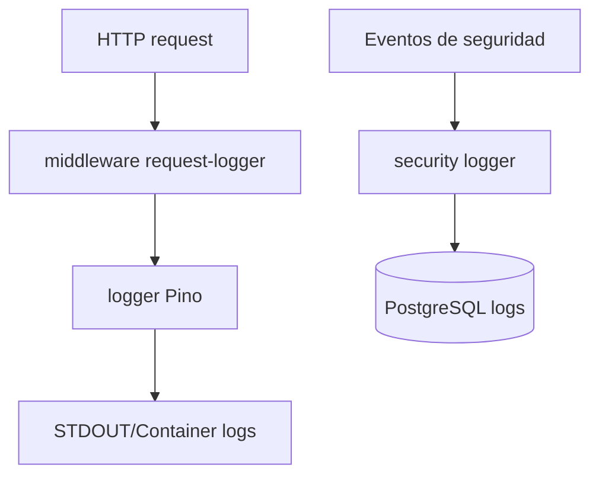

# Observabilidad

## Proposito

Componentes de registro y puntos de emision.

## Diagrama (Mermaid)

```mermaid
flowchart TB
  req[HTTP request] --> logger[middleware request-logger]
  logger --> pino[logger Pino]
  pino --> stdout[STDOUT/Container logs]

  sec[Eventos de seguridad] --> sec_logger[security logger]
  sec_logger --> db[(PostgreSQL logs)]
```
