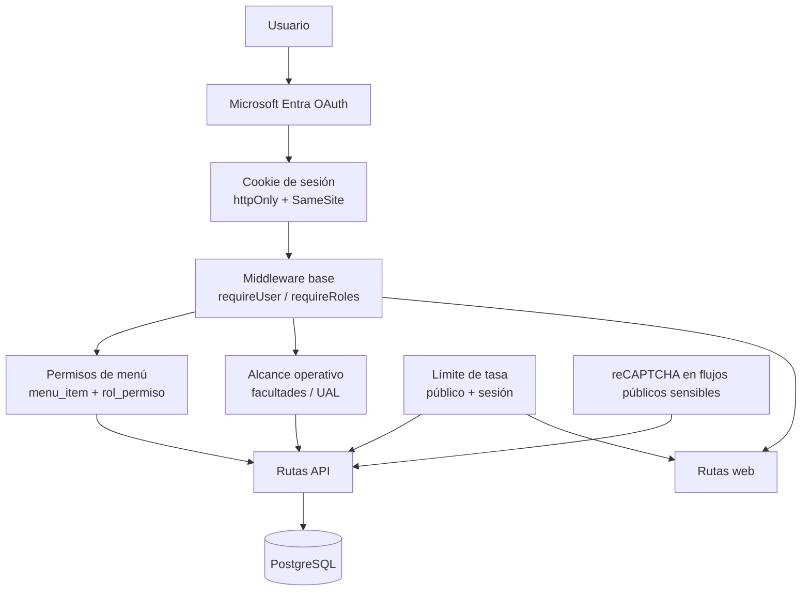

# Seguridad y RBAC

## Proposito

Resumen de autenticación, control de acceso, límites y alcance operativo por rol en MILab.

## Diagrama (Mermaid)

## Notas Clave

- OAuth2 vía Microsoft Entra con `state` habilitado.
- Sesión con cookie `httpOnly`, `SameSite` configurable y sin `saveUninitialized`.
- RBAC basado en roles persistidos en `usuario_rol` y permisos de menú en `rol_permiso`.
- El permiso visual del menú no reemplaza la validación backend: las rutas siguen protegidas con `requireUser(...)` y `requireRoles(...)`.
- `Monitoreo` ya no es exclusivo de `admin`: también lo usan `coordinador` y `laboratorista`, con alcance filtrado por facultades o UAL.
- Los formularios públicos sensibles mantienen rate limit y, donde aplica, validación reCAPTCHA.

## Roles Operativos

| Rol             | Capacidades principales                                                                                  |
| --------------- | -------------------------------------------------------------------------------------------------------- |
| `admin`         | Vista global, administración, configuración, consultas operativas, monitoreo completo                    |
| `coordinador`   | Registro de laboratoristas, autorizaciones, consultas operativas de su alcance, monitoreo por facultades |
| `laboratorista` | Registro y retiro de sanciones, consultas operativas, paz y salvos, monitoreo por UAL                    |
| `estudiante`    | Solicitud y descarga de su certificado                                                                   |
| `docente`       | Solicitud y descarga de su certificado                                                                   |

## Alcance De Monitoreo

El acceso a `/milab/api/dashboard` depende de rol y alcance:

| Rol             | Fuente de alcance                                       | Cobertura                 |
| --------------- | ------------------------------------------------------- | ------------------------- |
| `admin`         | No aplica                                               | Toda la plataforma        |
| `coordinador`   | `resolveCoordinatorScope(...)` + `coordinador_facultad` | Solo facultades asignadas |
| `laboratorista` | `laboratorista` + `laboratorista_ual`                   | Solo UAL asignadas        |

Indicadores disponibles:

- `admin`: estudiantes, docentes, sanciones, sanciones activas, sanciones saldadas, laboratoristas, coordinadores y usuarios registrados.
- `coordinador`: estudiantes, sanciones, sanciones activas, sanciones saldadas, laboratoristas, coordinadores y usuarios registrados.
- `laboratorista`: sanciones, sanciones activas, sanciones saldadas y laboratoristas.

## Amenazas Y Mitigaciones

- Suplantación OAuth en callback: uso de `state` en el flujo OAuth2.
- Fijación o robo de sesión: cookie `httpOnly`, `SameSite`, `secure` cuando aplica y regeneración de sesión tras login.
- Abuso de rutas públicas: rate limit en endpoints públicos y sensibles.
- Automatización en formularios públicos: reCAPTCHA en flujos como consulta de invitado y validaciones expuestas.
- Escalamiento horizontal de privilegios: RBAC por backend y permisos persistidos en BD.
- Escalamiento por alcance de datos: el dashboard y varias consultas filtran por facultades o UAL según el rol.
- Trazabilidad: eventos relevantes se registran en `log`.

## Ejemplos De Rutas Y Controles

| Ruta                                  | Control aplicado                                                                     | Origen                                                               |
| ------------------------------------- | ------------------------------------------------------------------------------------ | -------------------------------------------------------------------- |
| `/milab/api`                          | `menuPermissionMiddleware` con `menu_item` + `rol_permiso`                           | `src/milab_routes.js` + `src/routes/middlewares/menu-permissions.js` |
| `/milab/api/dashboard`                | `requireRoles(['admin', 'coordinador', 'laboratorista'])` + resolución de alcance    | `src/routes/api/dashboard.js`                                        |
| `/milab/api/aprobacion_multa`         | `requireRoles('coordinador')` + alcance por facultades                               | `src/routes/api/aprobacion_multa.js`                                 |
| `/milab/api/register_labs`            | `requireRoles(['admin', 'coordinador'])` + validaciones de conflicto con coordinador | `src/routes/api/register_labs.js`                                    |
| `/milab/api/download-pdf`             | `requireRoles(...)` + validación de ownership estudiante                             | `src/routes/api/download-pdf.js`                                     |
| `/milab/api/get-estado-multa/:codigo` | `publicApiLimiter` + validación numérica                                             | `src/routes/api/get-estado-multa.js`                                 |
| `/milab/api/consulta-invit`           | reCAPTCHA en POST                                                                    | `src/routes/api/consulta-invit.js`                                   |

## Menú Persistido Y Menú De Respaldo

El estado canónico del menú lo define `sql-scripts/db_seed_system.sql` mediante:

- `menu_item`
- `rol_permiso`

Cuando la BD no puede resolver el menú, `src/routes/middlewares/navigation.js` arma un fallback estático. Ese fallback puede conservar labels legacy, pero no modifica el control real de acceso.

## Referencias

- `src/routes/middlewares/auth.js`
- `src/routes/middlewares/menu-permissions.js`
- `src/routes/middlewares/navigation.js`
- `src/routes/api/dashboard.js`
- `sql-scripts/db_seed_system.sql`
