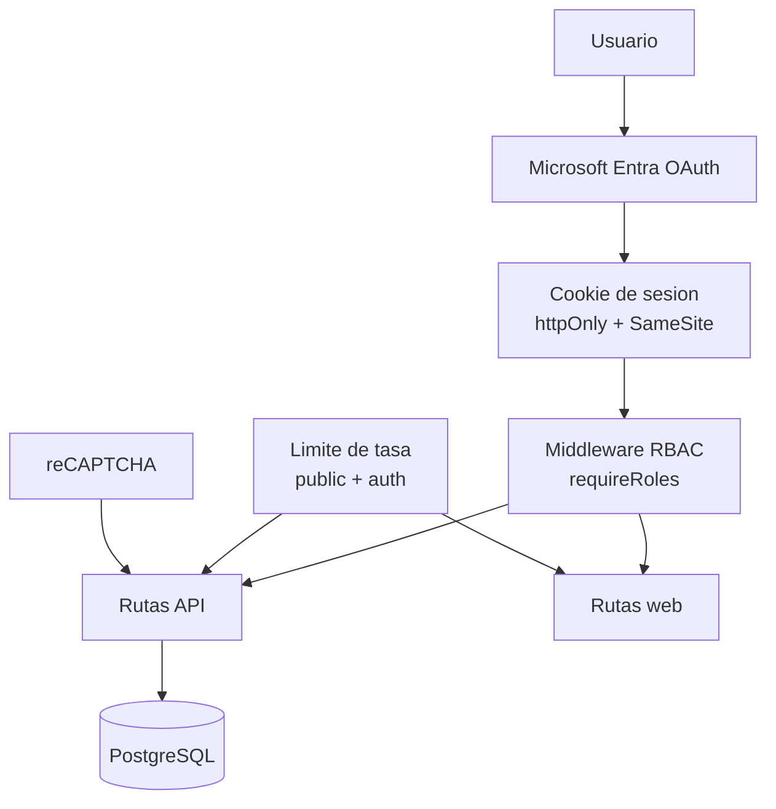

# Seguridad y RBAC

## Proposito

Resumen de autenticacion, control de acceso y limites.

## Diagrama (Mermaid)

## Notas clave

- OAuth2 via Microsoft Entra (state habilitado, sin offline_access).
- Sesion con cookie httpOnly, SameSite configurable, sin saveUninitialized.
- RBAC basado en roles y permisos de menu (ver docs/route-access-map.md).
- Limite de tasa para rutas publicas y autenticadas.
- reCAPTCHA en flujos sensibles.

## Amenazas y mitigaciones

- Suplantacion OAuth en callback: uso de state en flujo OAuth2.
- Fijacion o robo de sesion: cookie httpOnly + SameSite; secure cuando SESSION_SECURE=true; regeneracion de sesion tras login.
- Abuso de rutas publicas: limite de tasa en endpoints publicos.
- Automatizacion en formularios sensibles: validacion reCAPTCHA.
- Escalamiento de privilegios: RBAC con roles y permisos de menu persistidos en BD.
- Auditoria de seguridad: eventos registrados en tabla logs.

## Ejemplos de rutas y controles

| Ruta                                | Control aplicado                                         | Origen                                                           |
| ----------------------------------- | -------------------------------------------------------- | ---------------------------------------------------------------- |
| /milab/api                          | menuPermissionMiddleware (menu_items + role_permissions) | src/milab_routes.js + src/routes/middlewares/menu-permissions.js |
| /milab/api/download-pdf             | requireRoles + validacion de ownership estudiante        | src/routes/api/download-pdf.js                                   |
| /milab/api/get-estado-multa/:codigo | publicApiLimiter + validacion numerica                   | src/routes/api/get-estado-multa.js                               |
| /milab/api/consulta-invit           | reCAPTCHA en POST                                        | src/routes/api/consulta-invit.js                                 |
