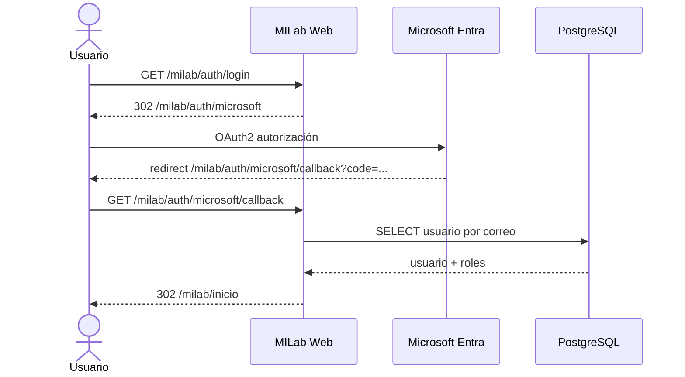
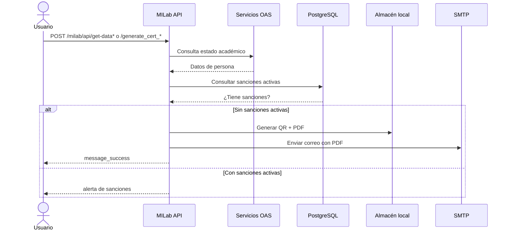
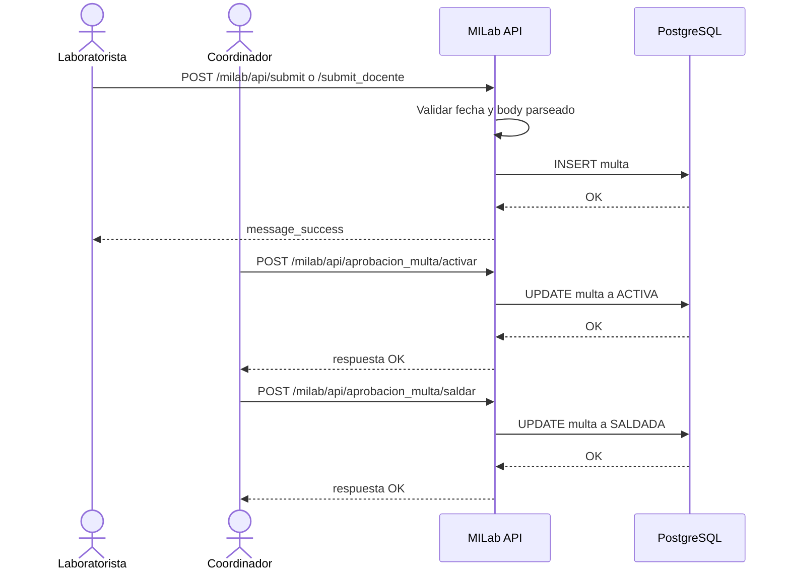
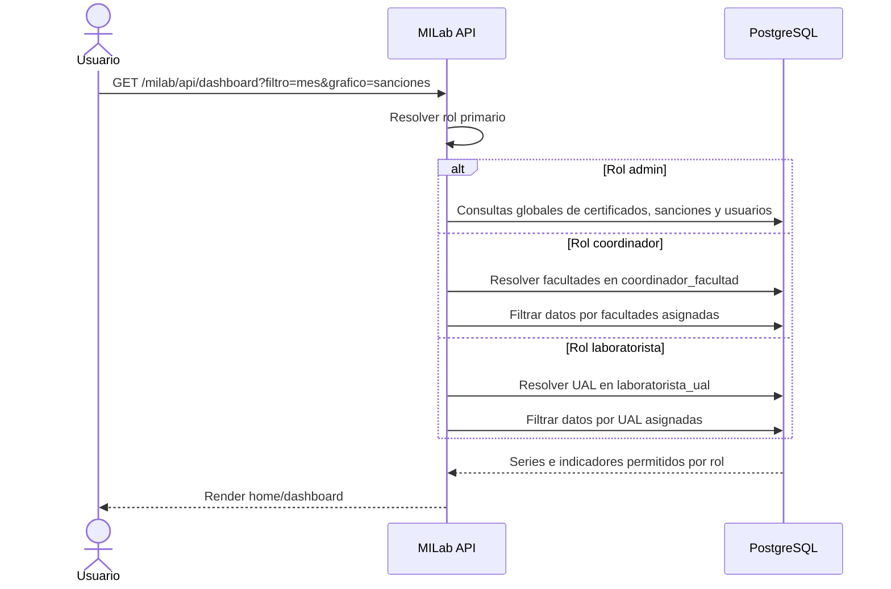
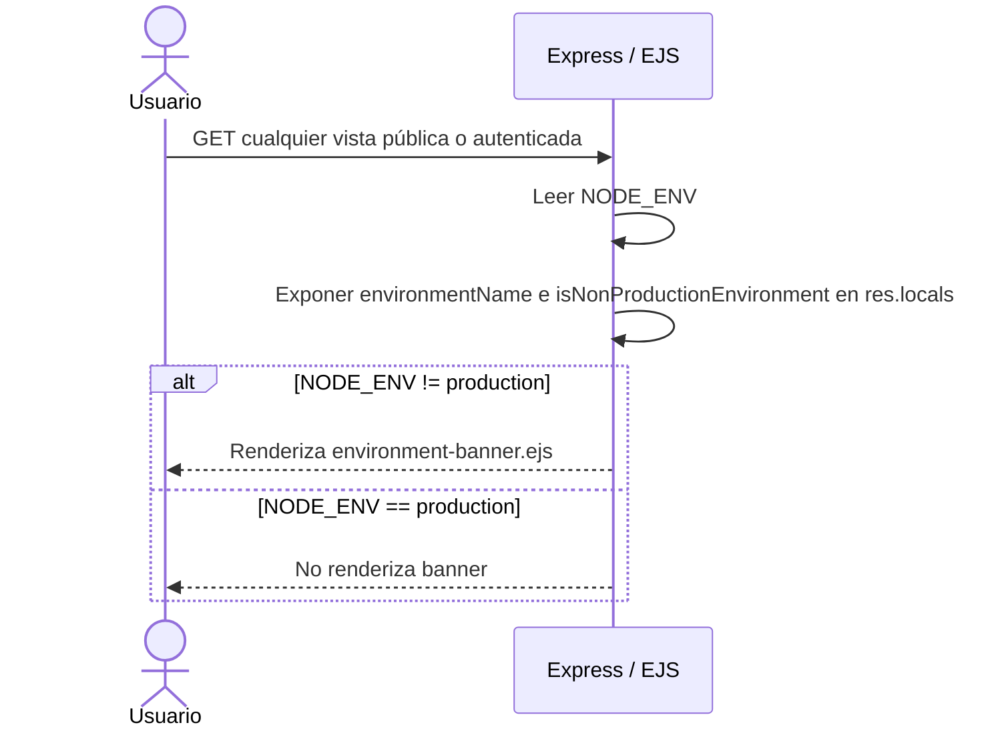

# Flujos Criticos (Secuencia / Actividad)

## Login Con Microsoft Entra

## Generación De Certificado (Estudiante / Docente)

## Flujo De Sanción (Registro Y Aprobación)

## Monitoreo Por Rol

## Banner De Ambiente No Productivo

