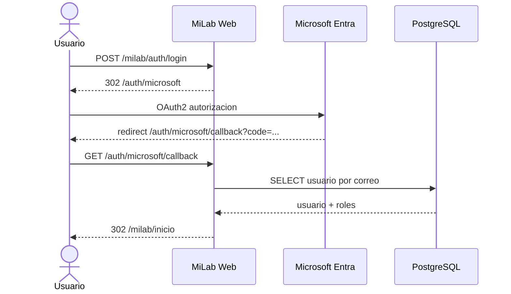
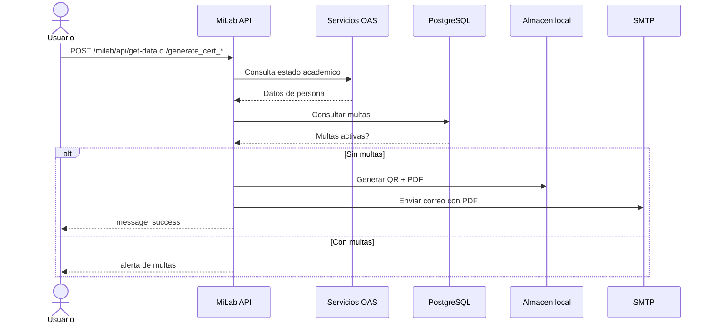
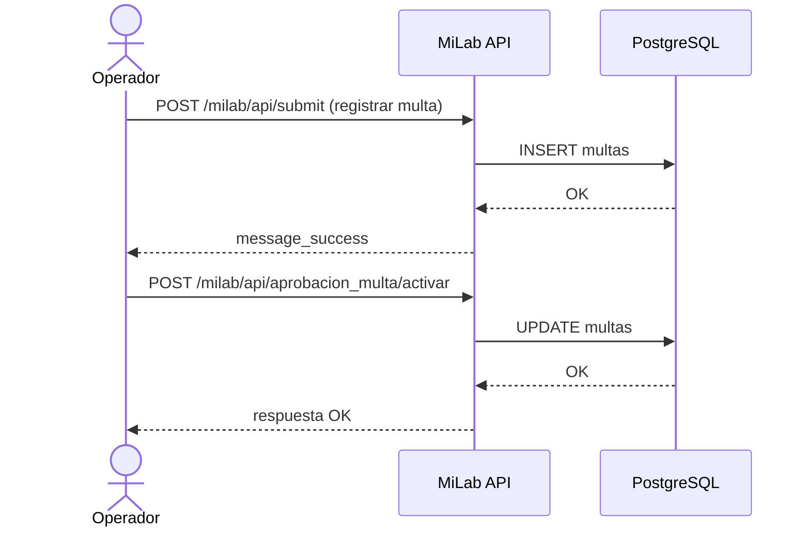

# Flujos criticos (Secuencia / Actividad)

## Login con Microsoft Entra

```mermaid
sequenceDiagram
  actor Usuario
  participant Web as MiLab Web
  participant Entra as Microsoft Entra
  participant DB as PostgreSQL

  Usuario->>Web: POST /milab/auth/login
  Web-->>Usuario: 302 /auth/microsoft
  Usuario->>Entra: OAuth2 autorizacion
  Entra-->>Usuario: redirect /auth/microsoft/callback?code=...
  Usuario->>Web: GET /auth/microsoft/callback
  Web->>DB: SELECT usuario por correo
  DB-->>Web: usuario + roles
  Web-->>Usuario: 302 /milab/inicio
```

## Generacion de certificado (estudiante/docente)

```mermaid
sequenceDiagram
  actor Usuario
  participant Web as MiLab API
  participant OAS as Servicios OAS
  participant DB as PostgreSQL
  participant FS as Almacen local
  participant SMTP as SMTP

  Usuario->>Web: POST /milab/api/get-data o /generate_cert_*
  Web->>OAS: Consulta estado academico
  OAS-->>Web: Datos de persona
  Web->>DB: Consultar multas
  DB-->>Web: Multas activas?
  alt Sin multas
    Web->>FS: Generar QR + PDF
    Web->>SMTP: Enviar correo con PDF
    Web-->>Usuario: message_success
  else Con multas
    Web-->>Usuario: alerta de multas
  end
```

## Flujo de multa (registro y aprobacion)

```mermaid
sequenceDiagram
  actor Operador
  participant Web as MiLab API
  participant DB as PostgreSQL

  Operador->>Web: POST /milab/api/submit (registrar multa)
  Web->>DB: INSERT multas
  DB-->>Web: OK
  Web-->>Operador: message_success

  Operador->>Web: POST /milab/api/aprobacion_multa/activar
  Web->>DB: UPDATE multas
  DB-->>Web: OK
  Web-->>Operador: respuesta OK
```
